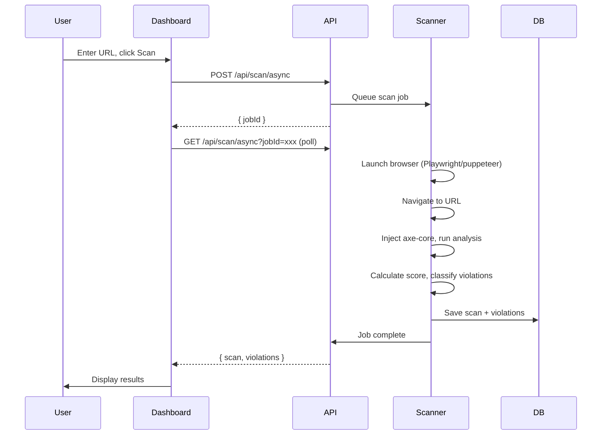
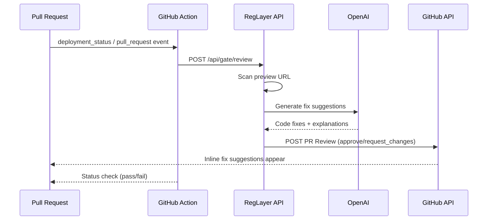
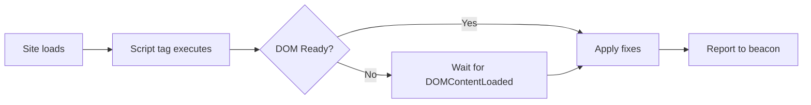
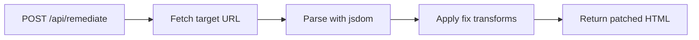
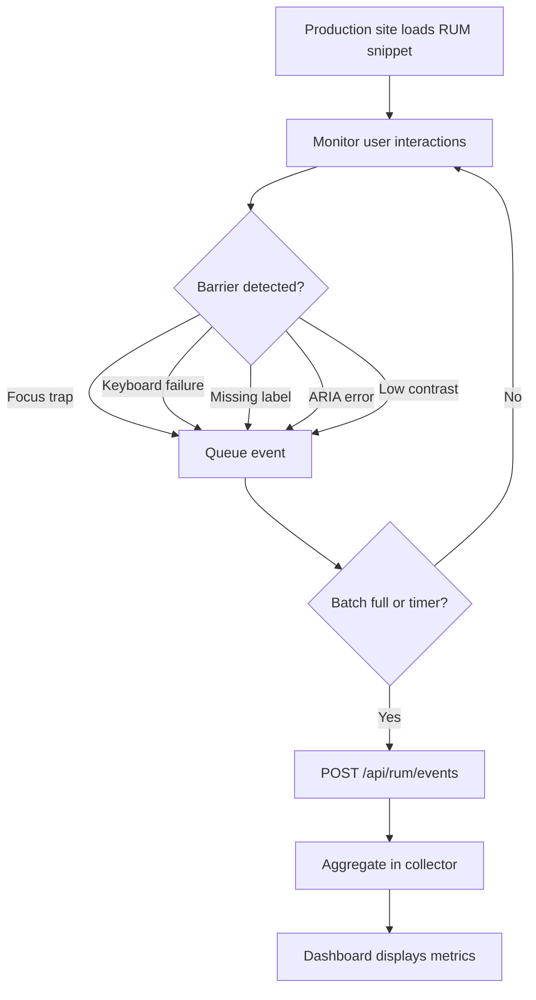
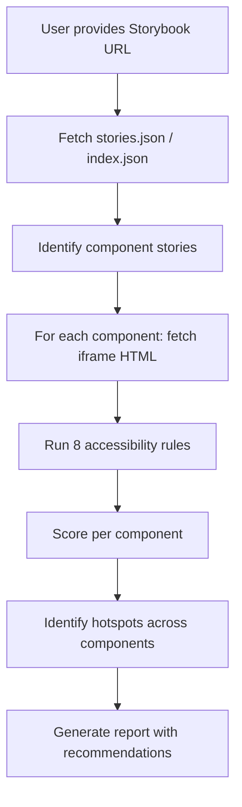
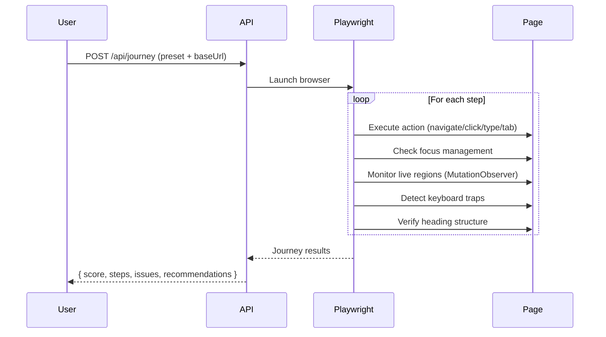
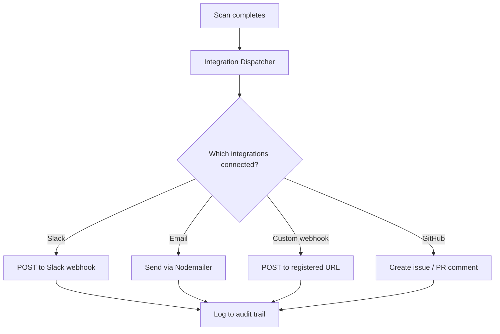
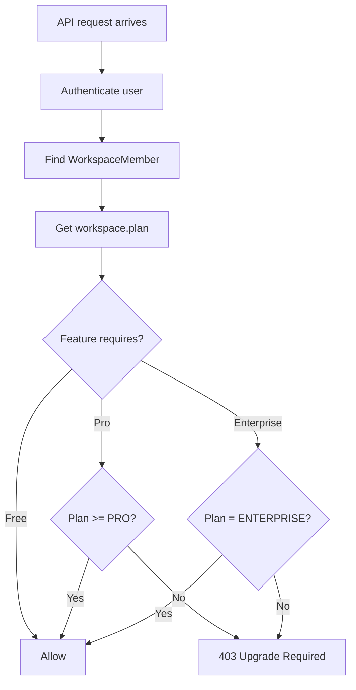

# RegLayer — Workflow Documentation

## Scan Workflow

---

## CI Gatekeeper Workflow

---

## Remediation Workflow

### Client-Side (Drop-in Script)

### Server-Side (Proxy Mode)

---

## RUM Event Flow

---

## Design System Scan Workflow

---

## Journey Flow Scan

---

## Webhook Notification Flow

---

## Plan Gating Logic

